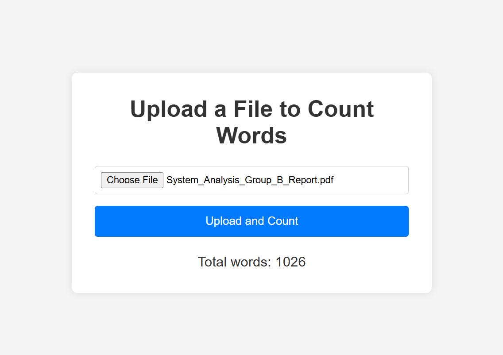

# Word Counter Application

A lightweight web application built with **Python (Flask)** on the backend and **HTML, CSS, JavaScript** on the frontend.  
Users can upload files through the UI, and the backend processes them to return a JSON response containing the total word count.

---

## ✨ Features
- Upload files via a simple web interface
- Supported formats: `.docx`, `.pdf`, `.csv`, `.txt`
- Backend powered by Flask
- Frontend built with HTML, CSS, and JavaScript
- Returns results as JSON for easy integration
- Basic text cleaning (removes punctuation, converts to lowercase)

---

## 📂 Project Structure
```text
Word-Counter/
│
├── app.py              # Flask backend entry point
├── base.html       # Frontend UI
├── count_words.py
├── file_manager.py
├── static/
│   ├── base.css       # CSS styling
│   └── base.js       # JavaScript logic
├── requirements.txt    # Python dependencies
└── README.md           # Project documentation
```
---

## ⚙️ Installation

1. Clone the repository:
   ```bash
   git clone https://github.com/truthmyson/Word-Counter.git
   cd Word-Counter
2. Create a virtual environment (recommended)
   ```bash
   python -m venv venv
   source venv/bin/activate   # On Linux/Mac
   venv\Scripts\activate      # On Windows

3. Install dependencies
   ```bash
   pip install -r requirements.txt
---
## Usage
1. start the flask backend:
   ```bash
   python app.py
2. Open the frontend by runing the base.html file
3. Upload a file and receive a json response
   Example response:
   ```json
       {
        "status": "success",
        "data": {
          "file_name": "example.docx",
          "file_type": "docx",
          "word_count": 523,
          "processed_time": "2026-02-23 14:41:00",
          "response_error": 200
        }
      }

---
## 🛠 Development Mode
This project currently runs in development mode only.
For production deployment, additional configuration (Docker, Gunicorn, etc.) would be required.
---
## 📸 Screenshots


